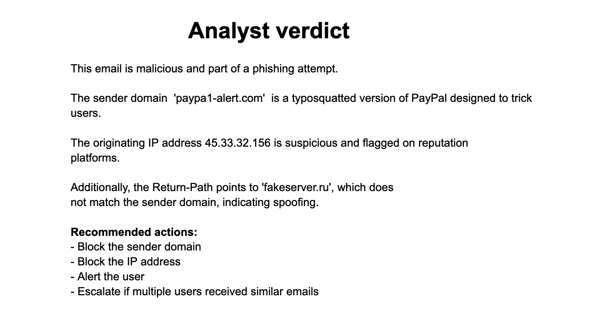

# Phishing Email Triage and IOC Extraction

Investigating a suspicious email through header analysis, threat intelligence, and IOC extraction to reach a phishing verdict based on technical evidence.

## At a Glance

| Field | Detail |
| --- | --- |
| Attack Type | Phishing and credential theft attempt |
| Vector | Suspicious email with impersonation and embedded links |
| Tools Used | MXToolbox, VirusTotal, browser based OSINT |
| Target | End user mailbox in a simulated environment |
| Originating IP | `45.33.32.156` |
| Outcome | Phishing activity identified and indicators documented |
| Primary MITRE ATT&CK | T1566.002 (Spearphishing Link) |

## What This Is

This project is a controlled phishing email investigation focused on the type of triage a SOC analyst may perform after receiving a suspicious message.

The goal was to move beyond how the email looked and investigate the technical evidence behind it.

I reviewed the message, analyzed its headers, investigated the associated infrastructure, extracted useful indicators, and reached an analyst verdict.

## Objective

The investigation focused on four questions.

1. Does the sender information support the identity claimed by the email?
2. What does the header information reveal about the message?
3. What can threat intelligence tell me about the associated infrastructure?
4. Does the combined evidence support a phishing verdict?

## Investigation Flow

```text
Suspicious Email
      |
      v
Initial Review
      |
      v
Header Analysis
      |
      v
Infrastructure Analysis
      |
      v
IOC Extraction
      |
      v
Analyst Verdict
```

## Initial Email Review

The investigation started with a suspicious email that appeared to impersonate a trusted organization.

The message used language intended to encourage the recipient to take action.

Rather than classifying the email from its appearance alone, I moved into technical analysis.


The email content provided context, but it was not enough by itself to confirm phishing.

**Verdict:** The message contained characteristics that justified deeper investigation.

## Header Analysis

The next step was reviewing the email headers.

Headers provide technical information about the message that is not immediately visible to the recipient.

I focused on the sender information, Return Path, originating IP, routing information, and available authentication information.


The header analysis identified sender information associated with:

```text
security@paypal-alert.com
```

The analysis also exposed the originating IP:

```text
45.33.32.156
```


The Return Path did not match the visible sender information.

The Return Path is used during email delivery for handling returned or failed messages. A mismatch can be useful during phishing triage, but it does not prove malicious activity by itself.

The header evidence therefore needed to be considered with the rest of the investigation.

**Verdict:** The sender and header information contained inconsistencies that required further validation.

## Infrastructure Analysis

After extracting the originating IP from the headers, I investigated it using VirusTotal.

The IP analyzed was:

```text
45.33.32.156
```


VirusTotal showed that:

```text
4 / 94 security vendors flagged the IP address as malicious.
```

This result was treated as supporting evidence rather than proof by itself.

Threat intelligence results can differ between vendors, and reputation should always be considered together with the surrounding investigation.


The infrastructure information associated the IP range with Akamai Connected Cloud.

This helped provide context about the infrastructure behind the address.

Infrastructure ownership alone does not establish malicious intent because legitimate cloud infrastructure can also be abused.

**Verdict:** Threat intelligence added reputation evidence associated with the originating IP, while infrastructure information provided additional context.

## IOC Extraction

The next step was documenting indicators that could support further investigation and defensive action.


The investigation documented indicators including:

| Indicator | Evidence |
| --- | --- |
| Originating IP | `45.33.32.156` |
| Sender Information | Suspicious sender identity |
| Return Path | Mismatch identified |
| Domain | Suspicious domain associated with the investigation |
| URL | Suspicious URL associated with the message |
| Subject | Urgent account themed language |
| Reputation | Threat intelligence findings recorded |

These indicators are more useful than simply labeling the email suspicious.

They can support searching, correlation, blocking, and future detection.

**Verdict:** Relevant indicators were extracted and documented for further investigation and response.

## Detection Reasoning

I did not classify the email as phishing because of one suspicious field.

The verdict came from combining multiple pieces of evidence.

I considered:

* The sender identity
* Header inconsistencies
* The originating IP
* Associated domains and URLs
* Threat intelligence results
* Infrastructure information
* Social engineering characteristics

A suspicious header field can have a legitimate explanation.

An IP reputation result can also be incomplete or misleading when viewed alone.

The evidence becomes stronger when independent findings point in the same direction.

## Investigation Findings

The investigation identified several characteristics associated with phishing activity.

The message used impersonation and urgency to encourage interaction.

Header analysis identified inconsistencies in the sender information.

The originating IP was extracted and investigated using threat intelligence.

VirusTotal showed that 4 of 94 security vendors flagged the IP as malicious.

Additional indicators were extracted and documented for further investigation and response.

## MITRE ATT&CK

### T1566.002 (Spearphishing Link)

This is the primary mapping for the project.

The suspicious email contained a link intended to encourage the recipient to interact with an external destination.

This behavior is consistent with phishing delivered through a link.

### T1036 (Masquerading)

The message used impersonation characteristics intended to make the email appear associated with a trusted organization.

This mapping represents the observed impersonation behavior.

## Analyst Conclusion

The combined evidence supports classifying the message as a phishing attempt.

The verdict was not based only on the appearance or wording of the email.

Header inconsistencies, sender information, the originating IP, associated indicators, and threat intelligence findings were considered together.

The VirusTotal result strengthened the investigation, but it was treated as supporting evidence rather than the sole reason for the verdict.

This approach produced a conclusion based on multiple technical findings instead of one suspicious characteristic.



**Verdict:** The combined email, header, infrastructure, and threat intelligence evidence supports the phishing classification.

## Recommended Response

For similar activity in a real environment, I would:

1. Mark the message as malicious after validating the evidence.
2. Block confirmed malicious domains and URLs.
3. Search the environment for other messages containing the same indicators.
4. Search for other activity involving the originating IP.
5. Determine whether any recipients interacted with the suspicious link.
6. Review available web or proxy telemetry for connections to confirmed malicious destinations.
7. Escalate the investigation if user interaction or additional suspicious activity is identified.

## The SOC Angle

A suspicious email is the beginning of the investigation, not the conclusion.

The analyst needs to determine what the available evidence actually supports.

That means reviewing the message, headers, infrastructure, indicators, and threat intelligence before reaching a verdict.

The investigation should then move beyond the original email.

The next question is whether the same indicators appeared elsewhere or whether a user interacted with the suspicious content.

## Lessons Learned

The main lesson from this investigation was that phishing analysis becomes stronger when several independent pieces of evidence are combined.

A Return Path mismatch alone does not prove phishing.

Urgent language alone does not prove phishing.

A threat intelligence result alone does not prove phishing.

In this investigation, the useful conclusion came from connecting the sender information, header inconsistencies, originating IP, infrastructure information, and reputation findings.

The lesson was simple.

Build the verdict from evidence, not from one suspicious signal.

## What I Would Improve

In the next version, I would extend the investigation beyond the original email.

I would search the environment for other messages containing the same sender information, domains, URLs, or originating IP.

I would also determine whether any recipient interacted with the suspicious link and correlate that activity with available web or proxy telemetry.

This would help answer a more important incident response question.

Did the phishing attempt result in user interaction or additional suspicious activity?

## What This Demonstrates

This project demonstrates my ability to:

* Triage a suspicious email using a structured investigation process
* Review email headers for technical evidence
* Identify useful sender and routing information
* Extract an originating IP from email headers
* Investigate infrastructure using threat intelligence
* Interpret VirusTotal results without treating them as absolute proof
* Extract and document indicators
* Separate suspicious characteristics from confirmed findings
* Combine multiple pieces of evidence before reaching a verdict
* Map observed phishing behavior to MITRE ATT&CK
* Recommend practical response actions
* Communicate a defensible analyst conclusion

## Repository Structure

```text
soc-day02-phishing-email-analysis/
├── README.md
└── images/
    ├── 01_email_overview.png
    ├── 02_header_analysis_1.png
    ├── 02_header_analysis_2.png
    ├── 03_link_check_1.png
    ├── 03_link_check_2.png
    ├── 04_indicators.png
    └── 05_conclusion.png
```

## Author

William Gokah

SOC Analyst Portfolio

[](https://linkedin.com/in/WilliamInCyber)

[](https://x.com/WilliamInCyber)
