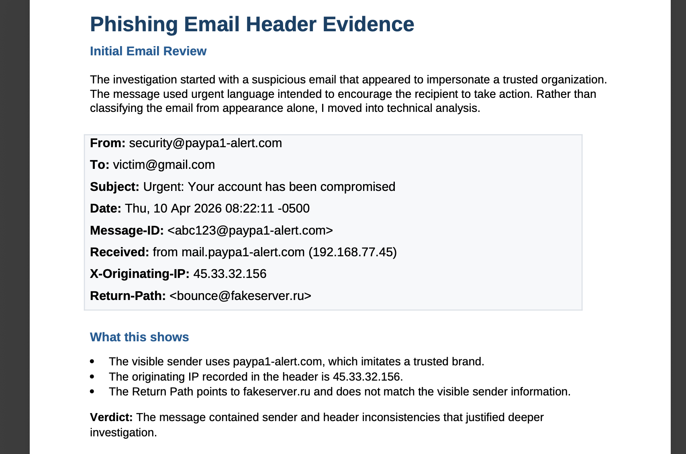
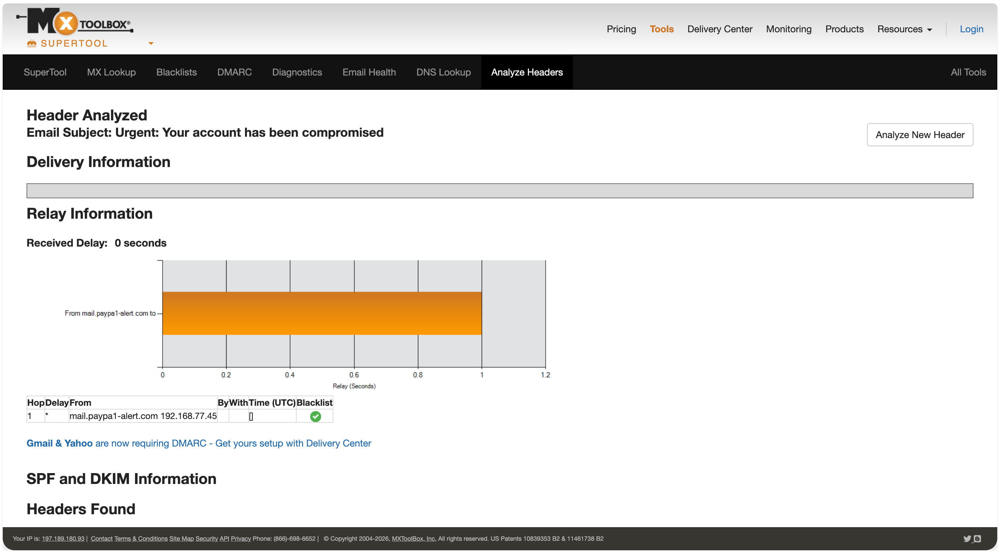
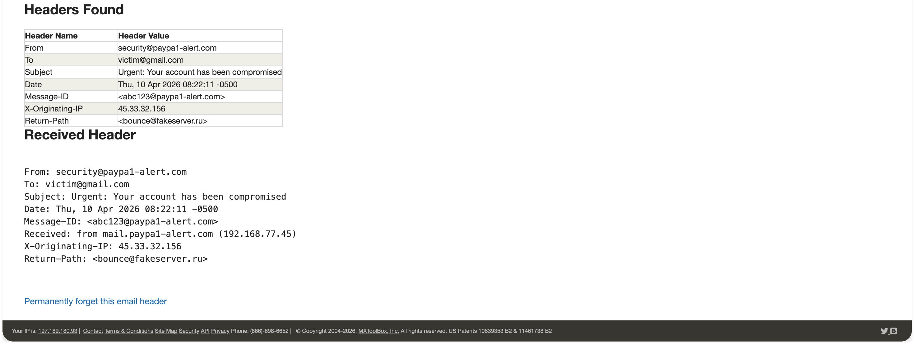
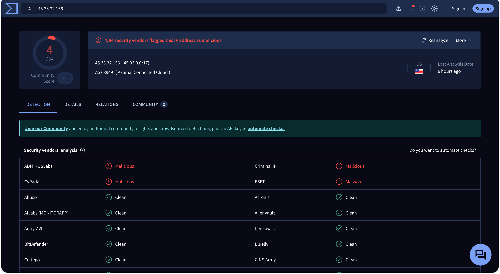
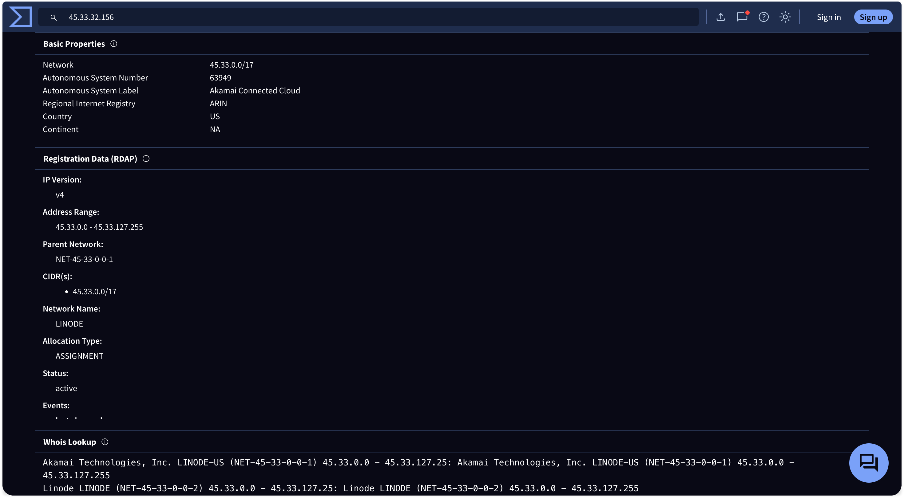
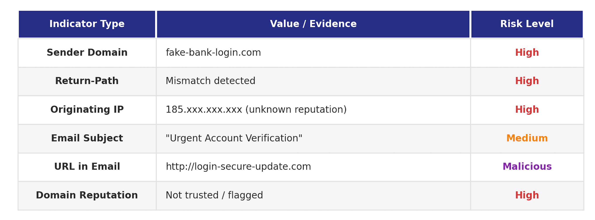

# Phishing Email Triage and IOC Extraction

Taking a suspicious email apart at the header and link layer, confirming it as phishing on technical evidence rather than gut feel, and pulling out the indicators worth blocking.

## At a Glance

| Field | Detail |
| --- | --- |
| Attack Type | Phishing, credential theft attempt |
| Vector | Email with spoofed sender and embedded links |
| Tools Used | MXToolbox, VirusTotal, browser based OSINT |
| Target | End user mailbox, simulated environment |
| Outcome | Confirmed phishing, IOCs extracted and documented |

## What Happened

An email arrived impersonating a legitimate organisation. It looked convincing enough to pass a quick glance, which is the entire point of a phishing email.

Content is not evidence. Anyone can write a convincing sentence. So the investigation ignored what the email said and went after what it could not fake: the headers and the links.

## Email Identification



The email was flagged on impersonation characteristics during initial review and pulled out for full analysis rather than deleted on sight. Deleting it answers nothing. Analysing it produces indicators.

## Header Analysis





Full headers were extracted and the routing path traced back to origin.

The display name is decoration. The Return Path is where a reply actually goes, and it did not match the From address. That mismatch is the sender telling on itself.

Originating infrastructure was traced and did not belong to the brand being impersonated.

## Link Analysis





Embedded URLs were extracted from the body and checked against threat intelligence sources rather than clicked.

Findings: redirect behaviour hiding the true destination, untrusted domains behind friendly link text, and a landing page structure consistent with credential harvesting.

## Indicators Extracted



Spoofed sender domain built to resemble a legitimate brand.

Mismatch between the From address and the Return Path.

Suspicious embedded URLs with redirect behaviour.

Unverified originating IP address.

Message structure engineered for urgency and deception.

## Detection Logic

An email is classified as phishing when the technical evidence stacks:

Sender identity cannot be verified against the claimed domain.

Header metadata is internally inconsistent.

Links resolve to untrusted or unknown infrastructure.

Infrastructure reputation is poor or absent.

Content applies urgency pressure to force action before thought.

No single condition convicts. The combination does.

## MITRE ATT&CK Mapping

| Tactic | Technique ID | Description |
| --- | --- | --- |
| Initial Access | T1566 | Phishing |
| Initial Access | T1566.002 | Spearphishing link |
| Defence Evasion | T1036 | Masquerading, domain impersonation |

## Analyst Conclusion

Email confirmed as a phishing attempt on header and link evidence.

Attacker used domain spoofing to borrow trust from a real brand.

Embedded links pointed to infrastructure consistent with credential harvesting.

The email passed basic trust filters and failed technical validation. That gap is exactly why analysts read headers.

## Recommended Response

Mark the email malicious and block the sender domain.

Submit the extracted URLs to threat intelligence platforms.

Add the IOCs to detection rules so the next one is caught on delivery.

Issue a user awareness notice covering this specific lure pattern.

## What This Lab Demonstrates

Reading email headers and spotting sender spoofing from routing metadata.

Investigating URLs safely using OSINT tooling instead of clicking them.

Extracting IOCs in a form that can be actioned into blocklists and detection rules.

Reaching a verdict on technical evidence rather than on how the email reads.

Mapping observed behaviour to MITRE ATT&CK.

## Repository Structure

```
├── README.md
├── images/
│   ├── 01_email_overview.png
│   ├── 02_header_analysis_1.png
│   ├── 02_header_analysis_2.png
│   ├── 03_link_check_1.png
│   ├── 03_link_check_2.png
│   ├── 04_indicators.png
│   └── 05_conclusion.png
```

---

[](https://linkedin.com/in/WilliamInCyber)
[](https://x.com/WilliamInCyber)

Send README 3.
